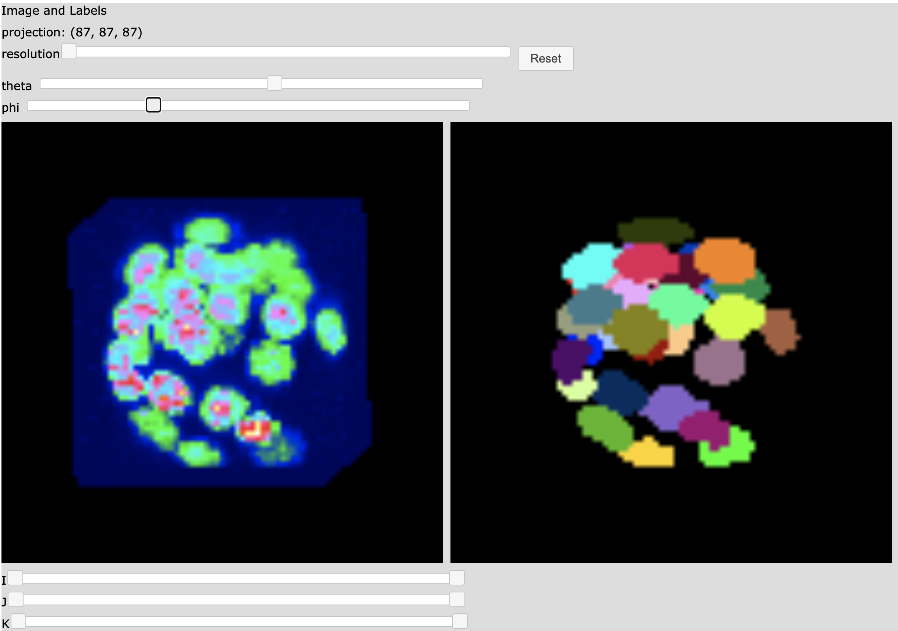

# array_gizmos
A collection of array operations and visualizations.

# Installation

This module is in experimental/development mode and it also uses experimental dependancies.

Install the jp_doodle dependancy manually in development mode:

```bash
% git clone https://github.com/AaronWatters/jp_doodle.git
% cd jp_doodle
% pip install -e .
% cd ..
```

Install the H5Gizmos dependancy manually in development mode:

```bash
% git clone https://github.com/AaronWatters/H5Gizmos.git
% cd H5Gizmos
% pip install -e .
% cd ..
```

Then install this module in development mode:

```bash
% git clone https://github.com/AaronWatters/array_gizmos.git
% cd array_gizmos
% pip install -e .
% cd ..
```



# How to use the labelled microscropy comparison visualization

This module includes a visualization implementation for comparing
labelled structure volumes with microscopy volumes.  The tool is designed
for use with the 
<a href="https://github.com/flatironinstitute/blastoSPIM_web">blastoSPIM project data sets</a>.

The
<a href="https://github.com/AaronWatters/array_gizmos/blob/main/notebooks/comparing%20labels%20and%20microscopy%20images.ipynb">
notebooks/comparing labels and microscopy images.ipynb
</a> notebook demonstrates how to load volume arrays into the viewer and start the viewer in a notebook,

The
<a href="https://github.com/AaronWatters/array_gizmos/blob/main/bin/compare_npz_labels">
bin/compare_npz_labels
</a> script demonstrates the how to load volume arrays into the viewer and start the viewer in a stand alone application.

The 
<a href="https://github.com/AaronWatters/array_gizmos/blob/main/bin/compare_npz_labels">
bin/compare_npz_labels
</a> script is installed  with this module as a command line script which will open and display
data from an numeric Python NPZ file formatted like the
<a href="https://github.com/flatironinstitute/blastoSPIM_web">blastoSPIM project data sets</a>.
For example the following command opens the test data set:
```bash
% cd array_gizmos/notebooks/
% compare_npz_labels labels_and_image.npz 

Open gizmo using link (control-click / open link)

<a href="http://127.0.0.1:51303/gizmo/http/MGR_1663167750012_4/index.html" target="_blank">Click to open</a> <br> 
 GIZMO_LINK: http://127.0.0.1:51303/gizmo/http/MGR_1663167750012_4/index.html 
```

Open the link provided in a suitable web browser to start the visualization.

## The volume alignment visualization

<a href="volume_alignment.md">Follow this link for documentation on how
to configure and use the label volume alignment interactive visualization.</a>

### Notes on the "overlayed segmentation" proof of concept (historical/deprecated)

<a href="overlayed_segmentation.md">Please follow this link for information
on how to use the overlayed segmentation proof of concept. (Temporary link.)</a>

