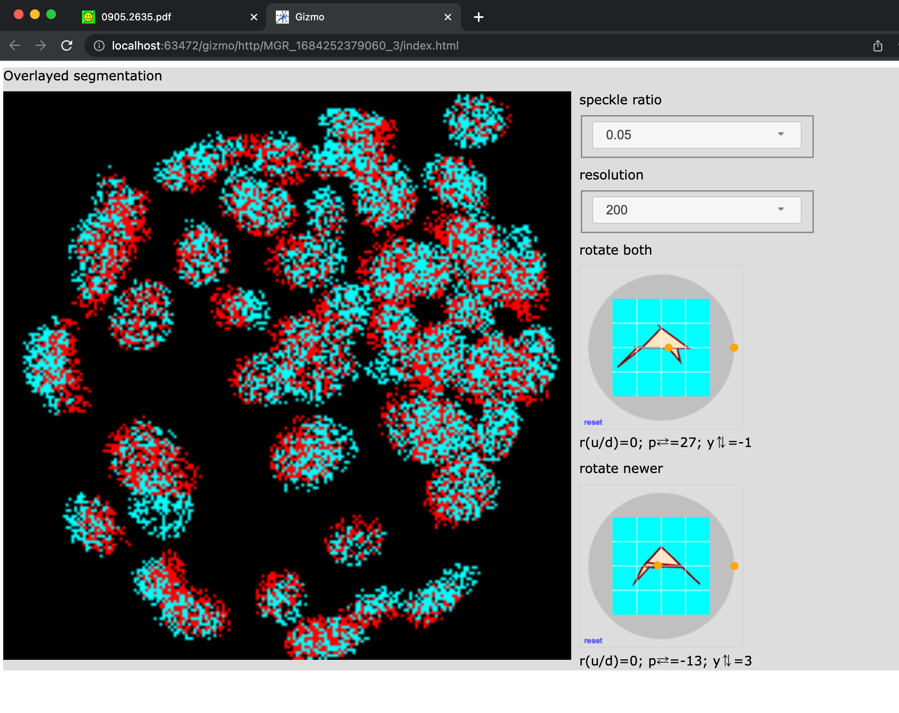

## The following documentation documents a deprecated interface.

# Notes on the overlayed segmentation proof of concept.

These are some temporary notes on the "overlayed segmentation" proof of concept.
This tool should be replaced by a more fully featured implementation soon.

The proof of concept overlays two label volume images and allows the user
to rotate the images to attempt to align them.

Start the proof of concept like so:

```bash
$ cd ~/repos/array_gizmos/
$ cd notebooks/
$ python test_overlayed.py 
Shape:: (200, 200, 200)

Open gizmo using link (control-click / open link)

<a href="http://localhost:64058/gizmo/http/MGR_1684266776990_3/index.html" target="_blank">Click to open</a> <br> 
 GIZMO_LINK: http://localhost:64058/gizmo/http/MGR_1684266776990_3/index.html 
```

Opening the link displayed in a browser generates an interface similar to this.



The interface overlays two sample image volumes from adjacent timestamps in a embryo
nucleus segmentation.  The "speckle ratio" adjusts the degree to which you can "see through"
the segmented nuclei.  The resolution adjusts the degree of detail (and the slowness) in the
interface.

The "paper airplane" controls allow you to adjust the rotations for the images.  The top
control rotates both images together.  The bottom control only rotates the "newer" timestamp.

Each "paper airplane" control allows the user to adjust the Roll, Pitch, and Yaw of the
rotations either by moving the selection circles using mouse clicks/drags or by using
key presses:  up/down arrow keys adjust the yaw; left/right arrow keys adjust the pitch;
U/D key presses adjust the roll.

The goal is to use the bottom control to align the two images and the top control to
examine the fidelity of the alignment in combination witht he speckle ratio and resolution adjustments.
