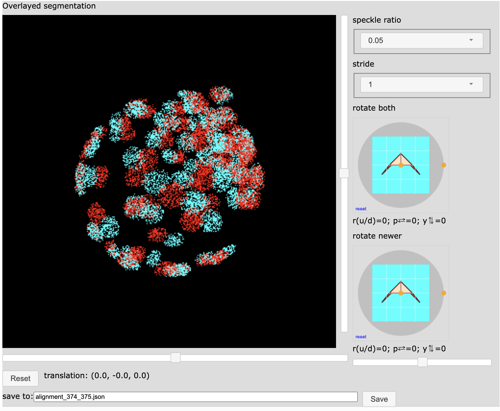

(This is preliminary documentation -- the interface is likely to change.)

# How to configure and use the label volume alignment interactive visualization

The `TimeStampPair` interactive interface is intended to examine and modify
the rotation and alignment of label volumes in two adjacent timestamps.

Configure the interface using a Python script which:

- Defines how to get label volumes for timestamps as `numpy` arrays.

- Specifies the geometry of the label volumes.

- Specifies the desired cubic geometry to use for the interface.

- Starts the interface (in 3 boilerplate steps below).

This `array_gizmos` repository incudes the example script
`array_gizmos/notebooks/test_align.py` which implements the above steps
for example data files that are also included in the repository
in the code fragment below:
```Python
# Contents of array_gizmos/notebooks/test_align.py

from H5Gizmos import serve
import numpy as np

from array_gizmos import align_volumes

def get_array(from_path):
    "This function defines how to read a label volume as a np array."
    loaded = np.load(from_path)
    return loaded["a"]

def get_volume_for_ts(ts):
    "This function defines how to use a label number to get a label volume."
    path = "a%s.npz" % ts
    return get_array(path)

# Specify the geometry of the label volumes
dI = 0.014  # The distance between A[1,1,1] and A[2,1,1]
dJ = 0.00158  # The distance between A[1,1,1] and A[1,2,1]
dK = 0.00168  # The distance between A[1,1,1] and A[1,1,2]
dIJK = (dI, dJ, dK)

# Use resampling to force the voxels to have this cubic side size:
dvoxel = 0.005

# Create a VolumeSequence object for reading volume data by timestamp.
Seq = align_volumes.VolumeSequence(dIJK, get_volume_for_ts)

# Create a timestamp pair object using the Sequence and the required cubic side size.
Pair = align_volumes.TimeStampPair(374, 375, Seq, dvoxel)

# Start the user interface for comparing the volume Pair.
serve(Pair.link())
```

The above line:

```Python
Pair = align_volumes.TimeStampPair(374, 375, Seq, dvoxel)
```

Creates a `TimeStampPair` object for timestamps 374 and 375 using label data read from
the files `a374.npz` and
`a375.npz`.  The resulting interface forces each voxel to be cubic with side length
`dvoxel = 0.005`.

Note that the script can use any positive value for `dvoxel` but values that are
too small will result in slow performance because the interface will manipulate too much
detail and values that are too large will result in an interface that doesn't have
enough detail to be useful.

When the example script is executed it prints a connection URL like this:

```bash
(base) HP07M20G6J:notebooks awatters$ python test_align.py 

Open gizmo using link (control-click / open link)

<a href="http://127.0.0.1:51266/gizmo/http/MGR_1686249927680_3/index.html" target="_blank">Click to open</a> <br> 
 GIZMO_LINK: http://127.0.0.1:51266/gizmo/http/MGR_1686249927680_3/index.html 
```

Openning the connection URL in a browser generates a user interface that looks like this:



## Explanation of components

The central image shows the labels of the newer timestamp overlayed on the labels of the older
timestamp to illustrate how well they match.

The adjacent sliders adjust the `Z` and `Y` translation of the new labels over.
The additional slider on the bottom right adjusts the `X` translation (which by default
points away from the screen).

The `rotate newer` aircraft rotation control adjusts the rotation of the newer timestamp labels
over the older timestamp labels.

The `rotate both` aircraft rotation controls allows the user to view the volume alignment from
different orientations without changing the alignment.

The `stride` dropdown allows the user to view the alignment at lower resolution in order
to manipulate the interface with better performance.  Higher strides show less detail at higher
performance.

The `speckle ratio` adjusts how well the user can "see through" the volumes.  Lower ratios
are more transparent.

The `save to` input allows the user to capture the alignment parameters in a JSON formatted
output file.
